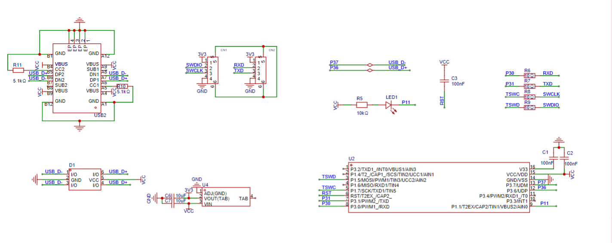

## 代码来源

基于梁山派 [daplink]() 改了串口的代码，修复了原版串口数据偶尔异常的问题，把原版一直闪烁的led灯改为了串口有数据传输时闪烁，同时把原版固定序列号改为了使用芯片唯一id作为usb序列号。其中串口和usb序列号的代码来源于 abgelehnt 的[Tiny-DAPLink](https://github.com/abgelehnt/Tiny-DAPLink)

## 功能说明

- 支持SWD接口
- 支持虚拟串口
- 支持多个daplink同时使用
- 仅支持winusb通讯
- 仅支持5V电压下工作

## 硬件说明

参考 wanfang 的开源工程[https://oshwhub.com/wanfang/ch552g-fang-zhen-qi](https://oshwhub.com/wanfang/ch552g-fang-zhen-qi)
或者 梁山派 daplink 的开源工程[https://oshwhub.com/lengyuefeng/a7c57e6d86bd47789178df3fda9219dc](https://oshwhub.com/lengyuefeng/a7c57e6d86bd47789178df3fda9219dc)



## 软件说明

自行使用keil编译，或直接使用我编译好的固件烧录即可

## 文件说明

```
C:.
│  CH552.H      //芯片头文件
│  DAP.c        //DAP源码
│  DAP.h        //DAP头文件
│  Debug.c      //芯片配置
│  Debug.h      //芯片配置头文件
│  main.c       //主程序与USB中断服务函数
│  readme.md
│  SW_DP.c      //SDW源码
│  Uart.c       //串口
│  Uart.h       //串口头文件
│  
├─firmware      //固件可直接烧录
│      CH55x_DAPLink.hex
│      
├─image         //原理图
│      原理图.png
│      
└─tool          //可能使用的工具
        CMSIS_DAP.dll   //5.28winusb无法识别补丁
        keil4.exe       //keil4安装包
        WCHISPTool_Setup.exe    //下载工具
```

## 鸣谢

[https://gitee.com/lcsc/lspiclink](https://gitee.com/lcsc/lspiclink)

[https://github.com/abgelehnt/Tiny-DAPLink](https://github.com/abgelehnt/Tiny-DAPLink)


